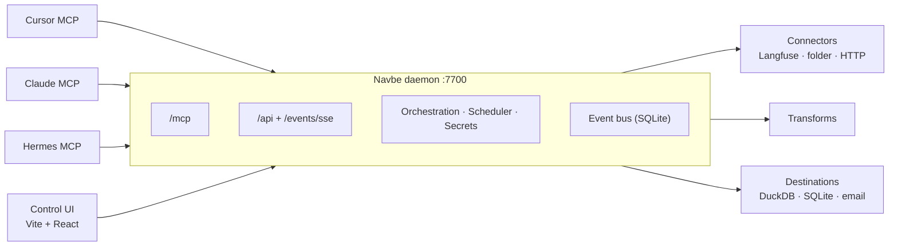

# Navbe AI

<p align="center">
  <strong>Local workflow hub for AI agents — MCP-first, laptop-first.</strong>
</p>

<p align="center">
  <a href="https://modelcontextprotocol.io/"></a>
  <a href="https://langchain-ai.github.io/langgraph/"></a>
  <a href="https://duckdb.org/"></a>
  <a href="https://fastapi.tiangolo.com/"></a>
  <a href="https://vitejs.dev/"></a>
</p>

Navbe turns natural-language intent from Cursor, Claude, Hermes, and peers into durable, schedulable data workflows. Agents connect through **MCP**; humans monitor through a **Control UI**. One local daemon owns schedules, run state, secrets, and the event bus — so every agent sees the same truth.

**Jarvis model:** many workflows can run at once. Many agents can author, observe, and subscribe. Status is never trapped in one chat session — ask *"how is the Langfuse process going?"* from any subscribed client and get the same answer.

| Surface | Role |
| --- | --- |
| **MCP** | Primary product — connect, propose/confirm workflows, schedule, preview, subscribe, query status |
| **Control UI** | Human cockpit — live runs, DAG canvas, connectors, destinations, reports |

Agents *drive*; the UI *reveals*. Both talk to the same hub — never two sources of truth.

---

## Start here — Local hub

> **First time?** Install, start the daemon, attach Cursor MCP, then open the Control UI.

| | |
| - | - |
| **[AGENTS.md](AGENTS.md)** | Product definition, architecture, MCP tool surface, conventions |
| **Duration** | ~15 minutes to daemon + MCP; first Langfuse sync in one agent chat |

```bash
# Quick start summary
uv sync
cd apps/web && pnpm install && cd ../..
uv run navbe daemon          # http://127.0.0.1:7700
# → wire Cursor MCP to /mcp/  (see below)
cd apps/web && pnpm dev      # http://localhost:5173
```

Once the daemon is up and MCP tools appear in Cursor, return here for MVPs and the multi-agent status flow.

---

## What Navbe includes

<table>
<tr><td><b>MCP-first orchestration</b></td><td>Agents create connectors, destinations, and workflows through tools — not ad-hoc scripts.</td></tr>
<tr><td><b>Shared local hub</b></td><td>One daemon; Cursor, Claude, Hermes, and the UI are peers on the same bus.</td></tr>
<tr><td><b>Pub/sub events</b></td><td>SQLite event log + SSE. Subscribe / pull_events / get_workflow_status — same truth for every client.</td></tr>
<tr><td><b>Langfuse → DuckDB</b></td><td>Incremental export, watermarks, retailer mart, analysis templates (MVP A).</td></tr>
<tr><td><b>Trace replay</b></td><td>Replay a Langfuse trace against an authenticated API, store results, structured diff (MVP B).</td></tr>
<tr><td><b>Daily HTML reports</b></td><td>Email destination (Resend/SMTP); preview and schedule retailer token/cost reports (MVP C).</td></tr>
<tr><td><b>Control UI + DAG</b></td><td>Live runs, connectors hub, React Flow DAG with SSE node coloring.</td></tr>
</table>

---

## Architecture



| Layer | Path | Role |
| ----- | ---- | ---- |
| **Core** | [`packages/navbe_core/`](packages/navbe_core/) | Workflow IR, LangGraph compile, run store, secrets |
| **MCP** | [`packages/navbe_mcp/`](packages/navbe_mcp/) | FastMCP tools + elicitation flows |
| **API** | [`packages/navbe_api/`](packages/navbe_api/) | FastAPI: MCP mount, REST, SSE |
| **Bus** | [`packages/navbe_notify/`](packages/navbe_notify/) | Durable pub/sub, subscribers, cursors |
| **Scheduler** | [`packages/navbe_scheduler/`](packages/navbe_scheduler/) | Cron, overlap locks, watermarks |
| **Plugins** | `navbe_connectors` / `destinations` / `transforms` | Langfuse, DuckDB, tag/mart steps |
| **CLI** | [`apps/cli/`](apps/cli/) | `navbe` entrypoint (`daemon`, `version`) |
| **UI** | [`apps/web/`](apps/web/) | Control UI — Workflows, Runs, Connectors, DAG |

### Project structure

```text
navbe_ai_v1/
├── AGENTS.md                 # Product & architecture source of truth
├── packages/
│   ├── navbe_core/           # Workflow IR, LangGraph, runs, secrets
│   ├── navbe_mcp/            # MCP tool registry
│   ├── navbe_api/            # FastAPI: MCP mount, REST, SSE
│   ├── navbe_notify/         # Durable event bus
│   ├── navbe_scheduler/      # Cron / overlap-safe scheduling
│   ├── navbe_connectors/     # Langfuse (+ folder/HTTP later)
│   ├── navbe_destinations/   # DuckDB / SQLite / email
│   └── navbe_transforms/     # Tag parse, retailer mart
├── apps/
│   ├── cli/                  # `navbe` entrypoint
│   └── web/                  # Control UI (Vite + React)
└── Makefile
```

---

## Prerequisites

| Tool | Used for | Install |
| ---- | -------- | ------- |
| **Python 3.12+** | Daemon, MCP, packages | [python.org](https://www.python.org/downloads/) |
| **uv** | Python workspace | [astral.sh/uv](https://docs.astral.sh/uv/getting-started/installation/) |
| **Node.js 20+** | Control UI | [nodejs.org](https://nodejs.org/) |
| **pnpm 9+** | UI deps | [pnpm.io](https://pnpm.io/installation) |

---

## Quick start

### 1 — Install

```bash
git clone <repo-url> navbe_ai_v1
cd navbe_ai_v1

uv sync
cd apps/web && pnpm install && cd ../..
```

Verify the CLI:

```bash
uv run navbe version
# → navbe 0.1.0
```

### 2 — Start the daemon

```bash
uv run navbe daemon
# → http://127.0.0.1:7700
```

| Endpoint | Purpose |
| -------- | ------- |
| `GET /health` | Liveness |
| `/mcp` | MCP (streamable HTTP) — connect your agent here |
| `/events/sse` | Live event stream for the Control UI |
| `/api/*` | REST for the Control UI |

Optional:

```bash
uv run navbe daemon --host 127.0.0.1 --port 7700
```

Profile data lives under `~/.navbe` (or `%USERPROFILE%\.navbe` on Windows). Override with `NAVBE_HOME`.

### 3 — Connect Cursor (MCP)

1. Keep the daemon running.
2. Add Navbe to Cursor MCP config (`~/.cursor/mcp.json` or `%USERPROFILE%\.cursor\mcp.json`):

   ```json
   {
     "mcpServers": {
       "navbe": {
         "url": "http://127.0.0.1:7700/mcp/",
         "headers": {}
       }
     }
   }
   ```

   Use **streamable HTTP** (URL), not stdio. Reload MCP / restart the agent so tools appear.

3. In chat, confirm tools like `list_connectors`, `create_langfuse_export_workflow`, `get_workflow_status`.

Any number of agents can attach to the same daemon. Status is shared across sessions.

### 4 — Control UI

```bash
cd apps/web
pnpm dev                       # http://localhost:5173
```

Vite proxies `/api` and `/events` to port `7700`.

| Page | What you see |
| ---- | ------------ |
| **Workflows** | Named workflows (`langfuse_daily`, …) and live status |
| **Runs** | Run history, step timings, metrics |
| **Connectors** | Sources (credentials/envs) and Destinations (DuckDB / SQLite / email) |
| **Reports** | Analysis templates over destinations |
| **DAG** | Workflow graph with live step coloring via SSE |
| **Replays** | Trace replay results and diffs |

---

## Run the MVPs from a Cursor agent

You do **not** need to call tools by hand. Open a Cursor Agent chat with Navbe MCP enabled and speak in natural language.

**Prerequisites:** daemon on `7700`, MCP entry above, Langfuse host + keys ready when the agent asks.

### MVP A — Monitor Langfuse → local DuckDB

**1. Connect and sync**

> Using Navbe MCP, connect to my Langfuse at `https://<host>` with public key `pk-lf-...` and secret key `sk-lf-...`. Create a DuckDB destination, then schedule a daily incremental export as process `langfuse_daily`. Preview first, then run it for real.

**2. Check progress (any agent / session)**

> How is the Langfuse process going? Subscribe as `cursor` and pull events. Call `get_workflow_status("langfuse_daily")`.

**3. Analytics**

> Using Navbe, list analysis templates for my DuckDB destination, then query tokens and cost per retailer per day from `mart_retailer_token_cost_daily`.

> How many traces do we have today, per hour?

```sql
SELECT strftime(CAST(timestamp AS TIMESTAMP), '%H') AS hour, count(*) AS traces
FROM traces
WHERE CAST(timestamp AS TIMESTAMP) >= current_date
GROUP BY hour
ORDER BY hour
```

**Under the hood:** `create_connector` → `create_destination` → `create_langfuse_export_workflow` → optional `preview_workflow` / `run_workflow` → `subscribe` / `get_workflow_status` → `query_destination` on the mart.

### MVP B — Replay a trace against your API

> Using Navbe MCP, replay Langfuse trace `<trace_id>` from my existing connector against `https://api.example.com/v1/...` with bearer auth. Store results in my DuckDB destination, return the structured diff, and save it as a reusable workflow.

Agent calls `replay_trace_to_api`. Inspect **Replays** in the Control UI.

### Multi-agent tip

Start the sync in Cursor, then in Claude or Hermes ask:

> How is `langfuse_daily` doing?

Both read the same hub — same watermark, same events, same status.

---

## Commands reference

| Command | Description |
| ------- | ----------- |
| `uv run navbe version` | Print CLI version |
| `uv run navbe daemon` | Start local hub on `:7700` |
| `uv run navbe daemon --port 7701` | Alternate port |
| `make check` | Python lint, types, tests |
| `cd apps/web && pnpm check` | Control UI lint / typecheck |
| `cd apps/web && pnpm test` | Control UI tests |
| `cd apps/web && pnpm dev` | Control UI on `:5173` |

E2E only:

```bash
uv run pytest packages/navbe_core/tests/test_mvp_cycle_e2e.py -q
```

---

## Development workflow

```bash
# Terminal 1 — daemon (hub)
uv run navbe daemon

# Terminal 2 — Control UI
cd apps/web && pnpm dev

# Terminal 3 — agent chat (Cursor / Claude / Hermes)
# MCP → http://127.0.0.1:7700/mcp/
```

1. **Install** — `uv sync` + `pnpm install` in `apps/web`
2. **Daemon** — `uv run navbe daemon`
3. **Attach** — Cursor MCP streamable HTTP → `/mcp/`
4. **Cockpit** — `pnpm dev` → Workflows / Runs / DAG
5. **Ship intent** — natural language → MCP tools → scheduled workflows

---

## Documentation

| Resource | What's covered |
| -------- | -------------- |
| [AGENTS.md](AGENTS.md) | Product principles, architecture, full MCP tool surface, glossary |
| [MCP](https://modelcontextprotocol.io/) | Protocol agents use to attach |
| [LangGraph](https://langchain-ai.github.io/langgraph/) | Step runtime (branching, checkpoints, interrupts) |
| [DuckDB](https://duckdb.org/docs/) | Default analytics destination |

For architecture, principles, and the complete tool list, treat [AGENTS.md](AGENTS.md) as the source of truth.

---

## Troubleshooting

| Symptom | Check |
| ------- | ----- |
| MCP tools missing | Daemon running? URL ends with `/mcp/`? Streamable HTTP selected? |
| Control UI empty / network errors | Daemon on `7700`? `pnpm dev` proxy to `127.0.0.1:7700`? |
| Wrong profile / stale DB | Inspect `NAVBE_HOME` (default `~/.navbe`) |
| Port in use | `uv run navbe daemon --port 7701` and update MCP + UI proxy |

---

## License

Proprietary — Navbe AI. All rights reserved unless otherwise noted.
